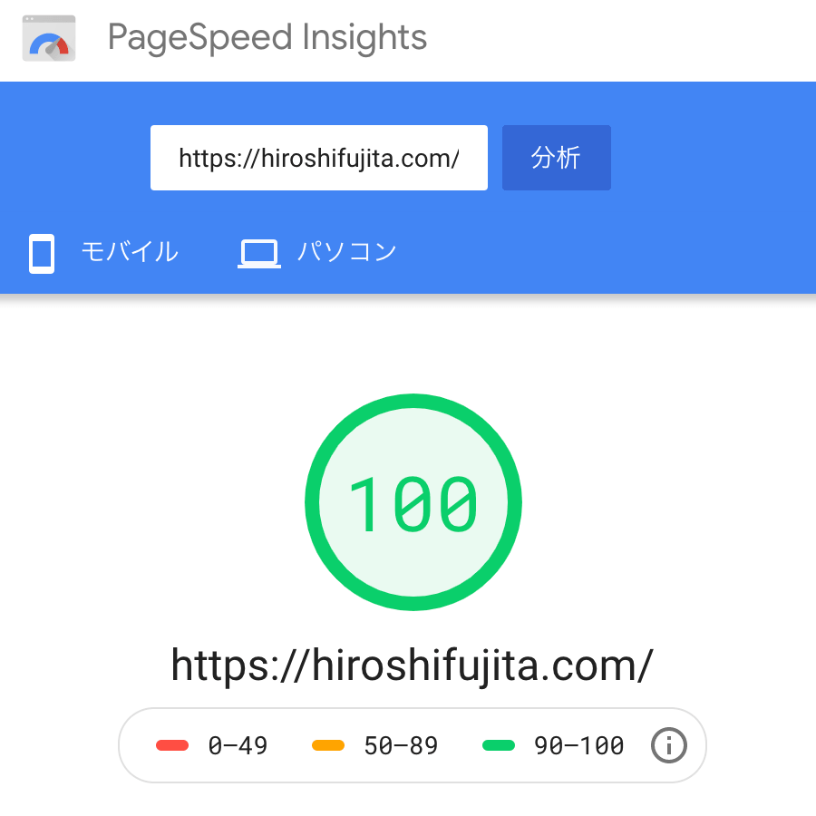
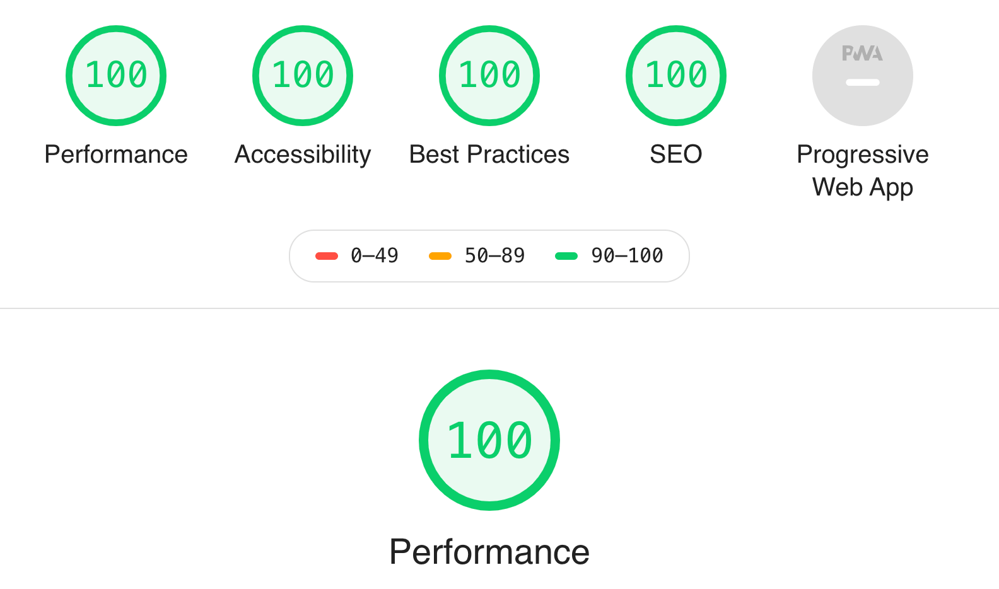

サイトの表示は一秒でも早くしたいという思いがあり、同僚に相談してみました。

そこで「クリティカルCSS」というワードを教えてもらいました。

簡単に言うと「ファーストビューの描画を早くしよう」というものです。

キーワードは「15Kbyte未満」。（1.5Kbyteだったかも。。）

細かい説明は、、、また書きたいですが、一旦、こちらを参照ください。

https://developers.google.com/speed/docs/insights/mobile?hl=ja

色々と工夫を入れ込んだ結果。。。

Page Speed で100点を獲得。

また、Lighthouse でも100点。

順調、順調。。。。

いろいろ作り込んでいく過程で、このスコアが下がらないようにがんばります。
